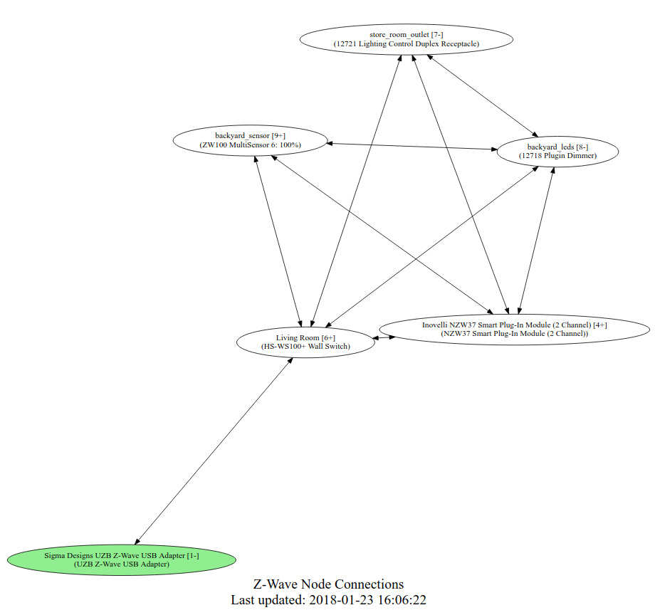

# home-assistant-z-wave-graph

Graph your Z-Wave mesh automatically from within Home Assistant.



## Update Info

2018-09-17:
 * Update to use the REST API as required by 0.77+.

2018-02-03:
 * Can work with the Docker image, but requires some hand-tuning. See the `Docker Image` section below.
 * Show the averageRequestRTT in () under the node name and in the mouse-over.
 * Revert the changes to make the edge width dependent on RTT. It was just too messy and did not add anything.
 * Edge width is now fixed. This helps see where the connections go when hovering.

2018-01-31:
 * **BREAKING:** The `--ssl` and `--port` flags have been removed. Set your `base_url` appropriately and it will work:
    * http://localhost
    * localhost:80
    * http://localhost:8123
    * https://localhost:8123
    * https://host.example.com:443

2018-01-26:
 * Default to no SSL for the API connection. You will need to add `--ssl` to your invocation if your HA uses SSL directly (i.e. not through a proxy).

2018-01-25:
 * No longer using Graphviz, neither the system package nor the Python module are required.
 * `config/www/svg-pan-zoom.min.js` is no longer needed, you may delete it.

## Install
Install the `networkx` Python module:
```
pip3 install networkx # from INSIDE your venv if you use one
```

## Suggested Integration

### Home Assistant Configuration

Requires the following secret for the iframe url:
```
z_wave_graph_url: http://YOUR_DOMAIN_HERE:8123/local/z-wave-graph.html
```
The Python script loads your HA configuration to try to pull out the details it needs. Some installations require more tweaks. See `~/bin/z-wave-graph.py --help` for command line options.

Put all the files in their correct location (assuming you're using a split configuration):
```
automation: !include_dir_merge_list automations/
shell_command: !include_dir_merge_named shell_commands/
panel_iframe: !include_dir_merge_named panel_iframe/
```

Otherwise you will have to put the fiddly bits into the right place by hand.

### Docker Image

Thanks to a diligent [HA forum member](https://community.home-assistant.io/t/graph-your-z-wave-mesh-python-auto-update/40549/87?u=omenwild) the mystery of the script not running in Docker images has been solved. One fix is in the code. The other you will have to apply at your end to the `shell_command`:
```
z_wave_graph: /usr/local/bin/python3 /config/**<YOUR-PATH>**/z-wave-graph.py
```

## Running

By default it is suppose to run every 5 minutes (`config/automations/z-wave-graph.yaml`) loading the current Z-Wave mesh. I experimented with on startup and shutdown, but the Z-Wave mesh did not exist at that point so the results were wrong.

## Graph

The graph is draggable and zoomable (mouse wheel).

The top node should be your Z-Wave controller, identified by primaryController in capabilities.

All nodes have mouse-over information with details. A **+** after the Node: id indicates a Z-Wave plus device. 

The diffent levels should correspond  to the hops in your mesh. You can click on a node to hilight the possible routes through other nodes.

Any battery powered devices will be rectangles and will have their battery level percent displayed in the mouse-over. 

## Algorithm 

The nodes and their neighbors are pulled from the HA API. networkx is then used to find all the shortest paths for each node back to the Z-Wave hub. Those edges are then graphed.

This only shows the route possibilites as there is no way to know exactly what route any particular node uses.

## Notes

Note: originally based on [home-assistant-graph](https://github.com/happyleavesaoc/home-assistant-graph) so parts may look very familiar
