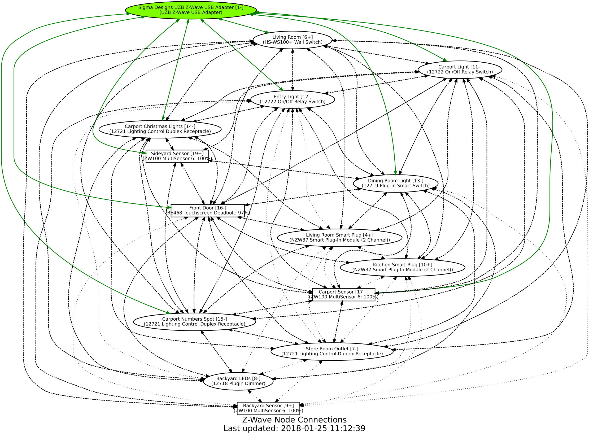

# home-assistant-z-wave-graph

Graph your Z-Wave mesh automatically from within Home Assistant.



## Install
Install `graphviz`:
```
apt-get install graphviz graphviz-dev # Debian/Ubuntu/Rasbian

pip3 install graphviz # from INSIDE your venv if you use one
```

## Suggested Integration

### Home Assistant Configuration

Requires the following secret for the iframe url:
```
z_wave_graph_url: http://YOUR_DOMAIN_HERE:8123/local/z-wave-graph.html
```
The Python script loads your HA configuration to pull out the details it needs.

Put all the files in their correct location (assuming you're using split configuration):
```
automation: !include_dir_merge_list automations/
shell_command: !include_dir_merge_named shell_commands/
panel_iframe: !include_dir_merge_named panel_iframe/
```

Otherwise you will have to put the fiddly bit into the right place by hand.

## Running

By default it will run every 5 minutes (`config/automations/z-wave-graph.yaml`) loading the current Z-Wave mesh. I experimented with on startup and shutdown, but the Z-Wave mesh did not exist at that point so the results were wrong.

## Graph

```
friendly_name [node_id +/-]
(product_name battery_level)
```

The green node should be your Z-Wave controller, identified by primaryController in capabilities.

Green lines indicate connections to your Z-Wave controller.

Dashed lines are nodes that are 2 hops from the Z-Wave controller.

Dotted lines are 3 or 4 hops from the Z-Wave controller.

The trailing `+/-` next to the node_id (in brackets) indicates Z-Wave+ or regular.

Any battery powered devices will have their battery level percent displayed next to the manufacturer. 

## Notes

Be sure to get [svg-pan-zoom.min.js](https://github.com/ariutta/svg-pan-zoom) and put it into `config/www/`.

Note: originally based on [home-assistant-graph](https://github.com/happyleavesaoc/home-assistant-graph) so parts may look very familiar
